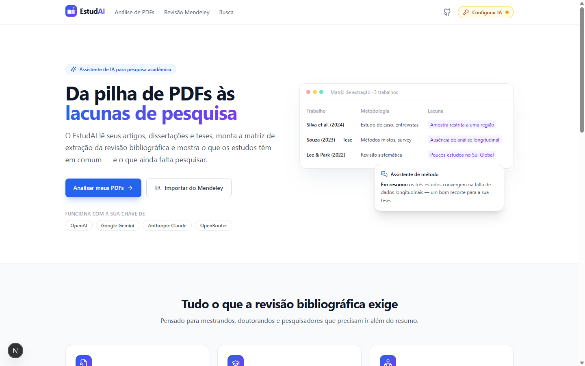
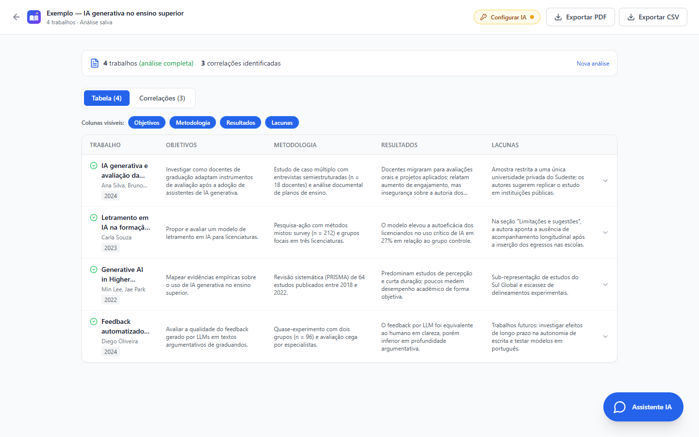
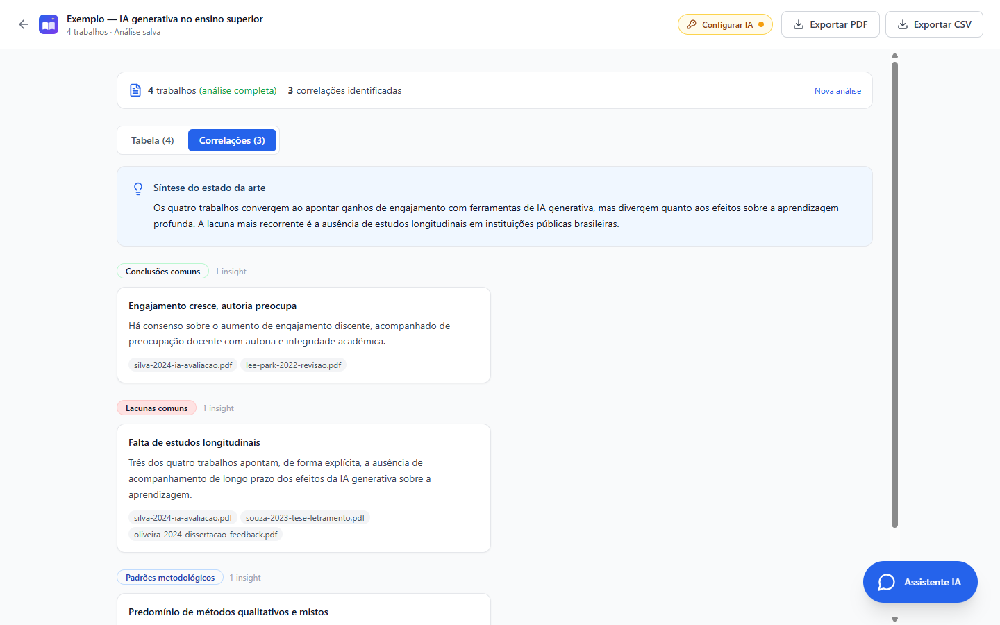
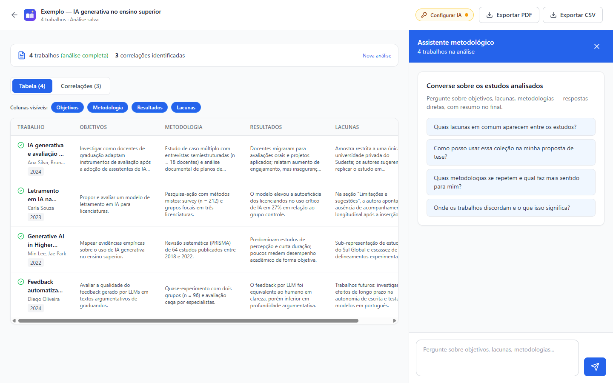
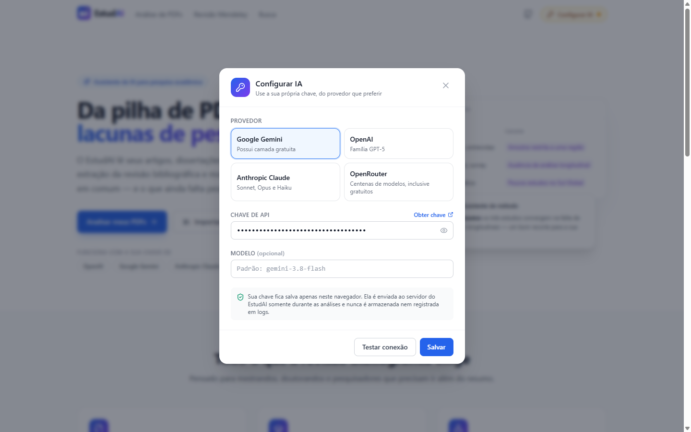
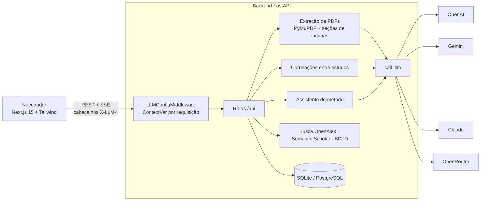

<div align="center">


# EstudAI

**Da pilha de PDFs às lacunas de pesquisa.**

Assistente de IA para revisão bibliográfica: extrai objetivos, metodologia, resultados e lacunas de até 50 artigos, dissertações e teses, encontra correlações entre os estudos e conversa com você como um orientador de método científico.

*AI research assistant for literature reviews — bring your own LLM key (OpenAI, Gemini, Claude or OpenRouter).*

[](https://github.com/ycarogb/EstudAI/actions/workflows/ci.yml)
[](LICENSE)


[Funcionalidades](#funcionalidades) ·
[Traga sua chave](#traga-sua-própria-chave) ·
[Arquitetura](#arquitetura) ·
[Como rodar](#como-rodar)

</div>

<br />



## Por que o EstudAI existe

Quem escreve uma dissertação ou tese passa semanas montando a **matriz de extração** da revisão bibliográfica: abrir cada PDF, encontrar o objetivo, a metodologia, os resultados e — o mais difícil — as **lacunas** que os próprios autores apontam, muitas vezes escondidas no fim do documento, em seções como *"Limitações e sugestões"* ou *"Trabalhos futuros"*.

O EstudAI automatiza esse trabalho braçal e deixa o pesquisador livre para a parte que importa: interpretar o estado da arte e decidir o recorte da própria pesquisa.

## Funcionalidades

| | |
|---|---|
| **Matriz de extração** | Objetivos, metodologia, resultados e lacunas de até 50 PDFs em uma tabela, com progresso em tempo real. |
| **Artigos, dissertações e teses** | Localiza as seções de limitações e trabalhos futuros no corpo do documento, ignorando entradas do sumário. |
| **Correlações entre estudos** | Conclusões comuns, lacunas recorrentes, padrões metodológicos, divergências e tendências. |
| **Assistente de método científico** | Chat contextual sobre a análise, com tom de orientador, respostas diretas e um bloco *"Em resumo"* no final. |
| **Histórico e retomada** | Cada análise fica salva com a conversa. É possível reprocessar só os PDFs que falharam e recalcular as correlações. |
| **Revisão Mendeley** | Importe sua coleção (BibTeX/RIS), anexe PDFs e analise lacunas, métodos, escopo e referências compartilhadas. |
| **Busca em bases abertas** | Descreva o tema em linguagem natural e busque em OpenAlex, Semantic Scholar e BDTD. |
| **Exportação** | Relatório em PDF, planilha CSV e referências em BibTeX. |

<table>
  <tr>
    <td width="50%"></td>
    <td width="50%"></td>
  </tr>
  <tr>
    <td align="center"><sub>Matriz de extração</sub></td>
    <td align="center"><sub>Correlações e síntese do estado da arte</sub></td>
  </tr>
  <tr>
    <td width="50%"></td>
    <td width="50%"></td>
  </tr>
  <tr>
    <td align="center"><sub>Assistente de método científico ao lado da matriz</sub></td>
    <td align="center"><sub>Configuração da IA com a chave do próprio usuário</sub></td>
  </tr>
</table>

<sub>As capturas usam uma análise de exemplo com trabalhos fictícios.</sub>

## Traga sua própria chave

O EstudAI não depende de um provedor específico. Cada pessoa informa, em **Configurar IA**, a chave do serviço que já usa — e paga diretamente a ele.

| Provedor | Modelo padrão | Onde obter a chave |
|---|---|---|
| Google Gemini | `gemini-3.8-flash` | [Google AI Studio](https://aistudio.google.com/apikey) (possui camada gratuita) |
| OpenAI | `gpt-5-mini` | [platform.openai.com](https://platform.openai.com/api-keys) |
| Anthropic Claude | `claude-sonnet-5` | [console.anthropic.com](https://console.anthropic.com/settings/keys) |
| OpenRouter | `openrouter/auto` | [openrouter.ai](https://openrouter.ai/keys) (centenas de modelos, inclusive gratuitos) |

O modelo pode ser trocado livremente na mesma tela.

**Como a chave é protegida**

- Fica salva apenas no `localStorage` do navegador.
- Viaja nos cabeçalhos `X-LLM-Provider`, `X-LLM-Model` e `X-LLM-Api-Key` somente nas requisições à API do EstudAI.
- No backend, um middleware ASGI coloca a configuração em uma `ContextVar` que vive apenas durante a requisição — inclusive nas respostas em streaming. Ela **nunca é gravada em banco nem registrada em logs**.
- O usuário escolhe o provedor, nunca a URL: os endereços dos provedores são fixos no servidor, o que evita SSRF.
- Opcionalmente, quem hospeda o servidor pode definir uma chave padrão no `.env`; a chave do usuário sempre tem prioridade.

## Arquitetura



| Camada | Tecnologias |
|---|---|
| Frontend | Next.js 15 (App Router), React 19, TypeScript, Tailwind CSS, lucide-react |
| Backend | FastAPI, Pydantic v2, SQLAlchemy 2 (async), PyMuPDF |
| LLMs | SDK da OpenAI (OpenAI, endpoints compatíveis do Gemini e OpenRouter) e SDK da Anthropic |
| Dados | SQLite por padrão, PostgreSQL opcional via Docker Compose |
| Qualidade | pytest + pytest-asyncio, GitHub Actions |

### Destaques de engenharia

- **Extração orientada a seções.** Teses e dissertações passam facilmente do limite de contexto. O texto é lido página a página, as entradas de sumário são descartadas e as páginas são pontuadas para encontrar as seções de limitações e trabalhos futuros, que recebem um orçamento reservado do contexto enviado ao modelo.
- **Uma interface para vários provedores.** Toda chamada passa por `call_llm`, que resolve a configuração da requisição e fala com OpenAI, Gemini e OpenRouter pelo protocolo compatível com OpenAI, e com o Claude pelo SDK da Anthropic. Modelos de raciocínio (GPT-5, série o) recebem os parâmetros que aceitam.
- **Streaming de progresso.** A análise de até 50 PDFs é transmitida via Server-Sent Events: cada trabalho aparece na tela assim que é extraído.
- **Resiliência.** Retentativas automáticas para limites de taxa, timeout configurável e reprocessamento apenas dos PDFs que falharam, seguido do recálculo das correlações com a coleção completa.
- **Prompting com persona.** O assistente responde como orientador de método científico, com contexto compacto da análise (até 40 trabalhos), histórico recente da conversa e um fechamento *"Em resumo"* obrigatório.
- **Testes sem rede.** Os SDKs dos provedores são substituídos por implementações falsas, o que permite validar a resolução de chaves, a prioridade entre usuário e servidor e a tradução de erros sem gastar créditos.

## Como rodar

### Pré-requisitos

- Python 3.12+
- Node.js 20+
- Docker e Docker Compose (opcional)
- Uma chave de API de qualquer provedor suportado — ela é informada na interface

### 1. Backend

Com Docker:

```bash
cp .env.example .env
docker compose up -d backend
```

Ou localmente:

```bash
cd backend
python -m venv .venv
source .venv/bin/activate        # Windows: .venv\Scripts\activate
pip install -r requirements.txt
uvicorn app.main:app --reload
```

A API fica em `http://localhost:8000`, com documentação interativa em `http://localhost:8000/docs`.

### 2. Frontend

```bash
cd frontend
npm install
npm run dev
```

Acesse `http://localhost:3000`, clique em **Configurar IA**, escolha o provedor, cole sua chave e use **Testar conexão**.

### Testes

```bash
cd backend
pip install -r requirements-dev.txt
pytest tests -q
```

## Configuração

Todas as variáveis são opcionais — sem nenhuma chave no servidor, cada usuário usa a própria.

| Variável | Descrição |
|---|---|
| `LLM_PROVIDER` | Provedor da chave padrão do servidor: `openai`, `gemini`, `anthropic`, `openrouter` ou `ollama` |
| `LLM_MODEL` | Modelo da chave padrão (vazio = modelo padrão do provedor) |
| `OPENAI_API_KEY`, `GEMINI_API_KEY`, `ANTHROPIC_API_KEY`, `OPENROUTER_API_KEY` | Chave padrão do servidor |
| `OLLAMA_BASE_URL` | Modelo local via Ollama |
| `LLM_TIMEOUT_SECONDS` | Tempo máximo de cada chamada ao modelo (padrão: 180) |
| `DATABASE_URL` | SQLite (padrão) ou PostgreSQL |
| `OPENALEX_EMAIL`, `SEMANTIC_SCHOLAR_API_KEY` | Identificação nas bases abertas |
| `CORS_ORIGINS` | Origens autorizadas a chamar a API |

> Em uma instância pública, não defina chave no servidor: ela ficaria disponível para todos os visitantes.

## Estrutura do projeto

```
EstudAI/
├── backend/
│   ├── app/
│   │   ├── agents/        # orquestração do chat e prompts
│   │   ├── analysis/      # análise de PDFs, correlações, histórico e reprocessamento
│   │   ├── api/           # rotas FastAPI e middleware da chave de IA
│   │   ├── db/            # modelos e sessão SQLAlchemy
│   │   ├── enrichment/    # enriquecimento de metadados (Crossref, OpenAlex)
│   │   ├── export/        # relatório em PDF
│   │   ├── extraction/    # cliente de LLM e resolução da configuração
│   │   ├── importers/     # Mendeley, RIS/BibTeX, anexos de PDF
│   │   └── search/        # OpenAlex, Semantic Scholar, BDTD
│   └── tests/
├── frontend/
│   ├── app/               # páginas (App Router)
│   ├── components/        # interface
│   └── lib/               # cliente da API e configurações de IA
├── docs/screenshots/
└── docker-compose.yml
```

## Roadmap

- [ ] Busca semântica (RAG) sobre o texto completo dos PDFs
- [ ] Integração com Scopus e Web of Science via credenciais institucionais
- [ ] Instância pública de demonstração
- [ ] Exportação da matriz para Word e LaTeX

## Licença

Distribuído sob a licença [MIT](LICENSE).

<div align="center">
<sub>Feito por <a href="https://github.com/ycarogb">Ycaro Batalha</a></sub>
</div>
